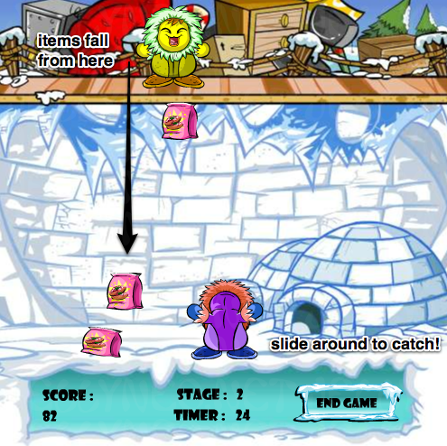

## Igloo Garage Sale

https://jhauf.github.io/IglooGarageSale/

### Background

Igloo Garage Sale is single page, 1-player game based on the classic Neopets Igloo Garage Sale game.  The computer player randomly drops items from above while the player below tries to catch all the items while avoiding the falling pianos.

### Functionality & MVP  

With Igloo Garage Sale, users will be able to:

- [ ] Move their character left and right to catch falling objects and avoid pianos. They lose if they drop 3 objects.

In addition, this project will include:

- [ ] An Instructions landing describing the background and rules of the game
- [ ] A production README

### Wireframes

This app will consist of a single screen with the game board, game controls, and nav links to my Github page, LinkedIn, and the landing page and instructions page.  Game controls include include Start, Stop and Mute music buttons as well left and right controls.

### Architecture and Technologies

This project was implemented with the following technologies:

- Vanilla JavaScript and `jquery` for structure and game logic,
- `HTML5 Canvas` for DOM manipulation and rendering,
- Webpack to bundle

In addition to the webpack entry file, there was multiple scripts involved in this project:

`game.js`: this script handles the logic for creating and updating the necessary `Canvas` elements and rendering them to the DOM.
`main.js`: this script handles the event listeners and logic for starting and stoping the game as well as the music
`piano.js`: this script constructs the `Piano` elements
`item.js`: this script constructs the `Item` elements
`computer.js`: this script constructs the `Item` elements
`avatar.js`: this script constructs the `Item` elements

### Implementation Details

**Day 1**: Setup Node modules, webpack.  Create `webpack.config.js` as well as `package.json`.  Write a basic entry file and start on the script above.  
