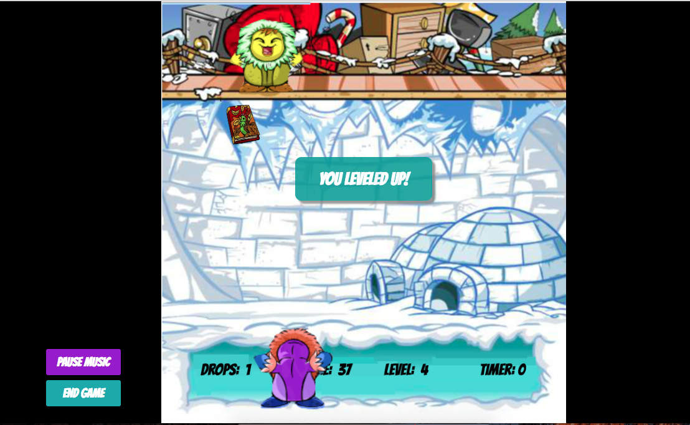

## Igloo Garage Sale

###[Link to Igloo Garage Sale](https://jhauf.github.io/IglooGarageSale/)

### Background

Igloo Garage Sale is single page, 1-player game based on the classic Neopets Igloo Garage Sale game.  The computer player randomly drops items from above while the player below tries to catch all the items while avoiding the falling pianos. As the players progress through the levels, the items fall faster and more frequently.

## Features
  - [ ] Game board designed using Canvas
  - [ ] Player can control the avatar by moving it left and right
  - [ ] The computer player drops items from above in random positions
  - [ ] Points are scored when player catches the items
  - [ ] Game gets progressively harder each level and 3 speed options
  - [ ] Game has thematic retro music
  - [ ] Pressing the mute button mutes the music
  - [ ] Pressing the end button ends the game
  - [ ] Game is over if the players drop 3 objects. The player then has the option to   play again

### Architecture and Technologies

This project was implemented with the following technologies:

- `Vanilla JavaScript` and `jQuery` for structure and game logic,
- `HTML5 Canvas` for DOM manipulation and rendering,
- `Webpack` to bundle

In addition to the `Webpack` entry file, there was multiple scripts involved in this project:

`game.js`: this script handles the logic for creating and updating the necessary `Canvas` elements and rendering them to the DOM.
`main.js`: this script handles the event listeners and logic for starting and stopping the game and music
`piano.js`: this script constructs the `Piano` elements
`item.js`: this script constructs the `Item` elements
`computer.js`: this script constructs the `Item` elements
`avatar.js`: this script constructs the `Item` elements

### Future Directions

- I would like to add sound effects to the game in the future
- I would also like to animate the items breaking on the floor
